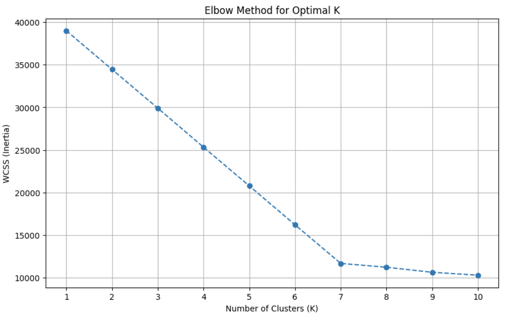
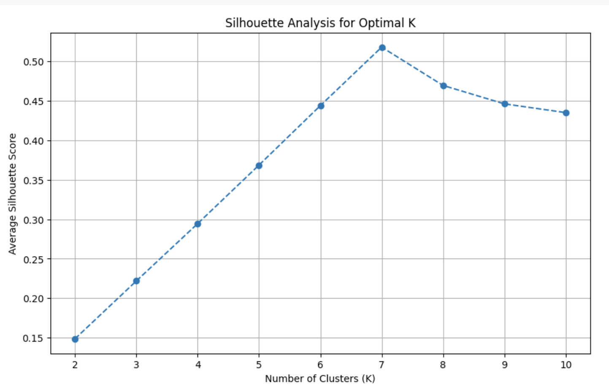

# 🛍️ AI 기반 고객 쇼핑 트렌드 대시보드

고객 쇼핑 데이터를 K-평균 클러스터링으로 분석하여 의미 있는 고객 그룹을 정의하고, 각 그룹의 특징을 시각화하는 웹 대시보드입니다. Google Gemini AI를 통해 각 고객 그룹을 대표하는 가상의 페르소나를 생성하고, 데이터 기반의 맞춤형 마케팅 전략을 제안받을 수 있습니다.

**✨ Live Demo: [https://shoppingtrendai.netlify.app/]**

---

## 🚀 주요 기능

- **고객 세분화 시각화**: K-평균 클러스터링으로 도출된 7개 고객 그룹별 핵심 지표(평균 연령, 구매액, 구독률 등)를 직관적으로 확인합니다.
- **상세 데이터 분석 대시보드**: 각 그룹의 Top 5 구매 아이템, 카테고리, 주요 활동 지역, 시즌별 선호도 등을 다양한 차트(막대, 도넛, 파이 등)로 시각화합니다.
- **클러스터 vs 전체 평균 비교**: 특정 고객 그룹의 구매 패턴이 전체 고객 평균과 어떻게 다른지 혼합 차트(막대+선)를 통해 한눈에 비교하고 인사이트를 얻을 수 있습니다.
- **AI 페르소나 생성**: Google AI가 각 클러스터의 데이터를 바탕으로, 해당 그룹을 대표하는 가상의 인물(이미지, 직업, 특징, 니즈)을 생성하여 고객에 대한 깊이 있는 이해를 돕습니다.
- **AI 마케팅 전략 제안**: 선택된 클러스터의 데이터 특성에 기반하여, 실행 가능한 구체적인 마케팅 액션 플랜을 AI에게 제안받을 수 있습니다.

---

## 🛠️ 기술 스택

| 구분              | 기술                                                       |
| :---------------- | :--------------------------------------------------------- |
| **Frontend**      | `React`, `TypeScript`, `Next.js` (App Router)              |
| **Backend /DB**   | `Supabase (Auth, Postgres DB)`                             |
| **Styling**       | `Tailwind CSS`                                             |
| **Charts**        | `Chart.js`, `react-chartjs-2`, `chartjs-plugin-datalabels` |
| **AI**            | Google Gemini API (`@google/genai`)                        |
| **Data Analysis** | `Python`, `Jupyter Notebook`, `Pandas`, `Scikit-learn`     |
| **Deployment**    | `Netlify`                                                  |

---

## ⚙️ 시작하기

프로젝트를 로컬 환경에서 실행하는 방법은 다음과 같습니다.

1.  **저장소 복제 (Clone)**

    ```bash
    git clone [https://github.com/hagalaz-star/shopping_trend.git](https://github.com/hagalaz-star/shopping_trend.git)
    cd shopping_trend
    ```

2.  **의존성 설치 (Install Dependencies)**

    ```bash
    npm install
    ```

3.  **Supabase 프로젝트 설정**

    - Supabase에서 새 프로젝트를 생성합니다.

    - SQL Editor에서 personas 테이블 생성 스크립트를 실행합니다. (이전 대화 내용 참고)

    - Authentication > Providers 메뉴에서 Email과 Google 로그인을 활성화합니다.

    - Authentication > Users 메뉴에서 게스트 로그인을 위한 계정을 수동으로 생성합니다.

4.  **환경 변수 설정 (.env.local)**

    - 프로젝트 루트에 `.env.local` 파일을 생성합니다.
    - Google AI Studio에서 발급받은 API 키를 아래와 같이 추가합니다.

      ```bash
      NEXT_PUBLIC_SUPABASE_URL=당신의_Supabase_프로젝트_URL
      NEXT_PUBLIC_SUPABASE_ANON_KEY=당신의_Supabase_anon_key

      # Google Gemini
      GEMINI_API_KEY=당신의_Gemini_API_키

      # Guest Login
      GUEST_EMAIL=Supabase에서_생성한_게스트_이메일
      GUEST_PASSWORD=Supabase에서_생성한_게스트_비밀번호
      ```

5.  **개발 서버 실행 (Run Development Server)**
    ```bash
    npm run dev
    ```
    이제 브라우저에서 `http://localhost:3000`으로 접속하여 대시보드를 확인할 수 있습니다.

---

## 📊 프로젝트 상세

### 1. 데이터 분석 및 모델링

대시보드에 사용된 데이터는 `shopping_trends_updated.csv` 파일을 기반으로 오프라인에서 분석 및 가공되었습니다. 전체 분석 과정과 코드는 아래 Jupyter Notebook에서 확인하실 수 있습니다.

> ➡️ **[전체 분석 과정 및 코드 보기](./notebooks/Shopping_Trends.ipynb)**

- **K-평균 클러스터링**: `Age`, `Purchase Amount`, `Subscription Status`, `Frequency of Purchases` 4가지 피처를 사용하여 고객을 7개의 그룹으로 세분화했습니다.
- **최적 K값 결정**: 엘보우 방법과 실루엣 점수를 통해 최적의 클러스터 개수(K=7)를 도출했습니다.
  _(참고: 아래 이미지는 실제 분석 결과 그래프로 교체해야 합니다.)_
  - 
  - 
- **결과 데이터 생성**: 각 클러스터의 특성 데이터와 함께, 비교 분석을 위한 **전체 고객 아이템별 평균 구매율** 데이터를 `overall_items_purchase_rate`로 추가하여 최종 `customer_segments_final.json` 파일을 생성했습니다.

### 2. AI 기능 구현

- **AI 페르소나**: 선택된 클러스터의 통계 데이터를 프롬프트로 구성하여 Google Gemini API에 전달하고, 응답으로 받은 이미지(Data URI)와 상세 설명을 파싱하여 `AiResultDialog` 컴포넌트에 표시합니다.
- **AI 마케팅 제안**: `AiSuggestionBox` 컴포넌트에서 클러스터의 특징을 요약한 프롬프트를 API에 전송하고, AI가 제안하는 마케팅 전략을 받아와 구조화된 목록으로 보여줍니다.

### 3. 사용자 및 데이터 관리

- **인증**: Supabase Auth를 활용하여 이메일/비밀번호, 소셜 로그인, 게스트 로그인 등 다양한 인증 방식을 구현했습니다. middleware.ts를 통해 라우트를 보호하고, 서버 액션에서 createServerClient를 사용하여 안전하게 사용자 세션을 관리합니다.

- **데이터베이스 연동**: 사용자가 생성하고 제목을 붙인 페르소나 데이터는 personas 테이블에 저장됩니다. 마이페이지에서는 RLS(Row Level Security) 정책이 적용된 쿼리를 통해 본인의 데이터만 안전하게 조회, 수정, 삭제할 수 있습니다.
